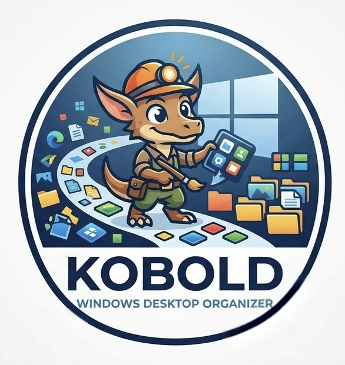
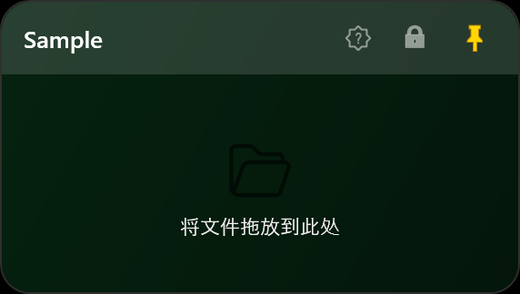
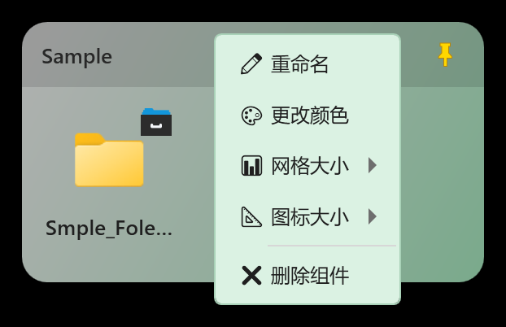
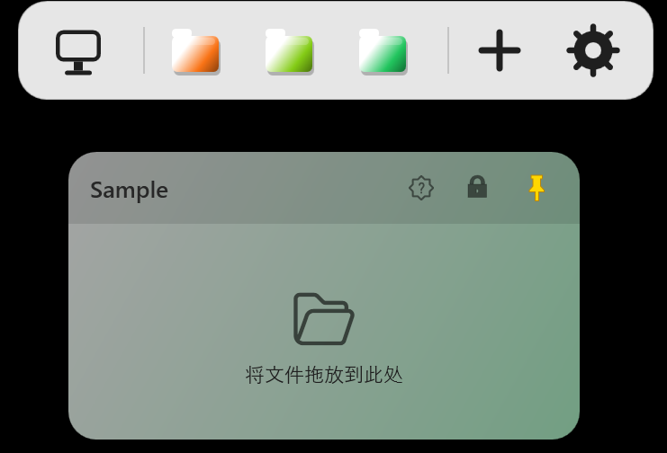

# Kobold — Windows Desktop Organizer

<div align="center">



**桌面整理小组件** | **Windows Desktop Folder Widgets**

Windows 10/11 · WPF · .NET Framework 4.8 · MIT

</div>

Kobold keeps your desktop tidy with a **dynamic-island launcher** at the
top of the screen and floating **folder panels**. Hover the island to
expand it: open the Desktop, jump into any widget, create a new one, or
open Settings — no need to hunt for the tray icon.

Built from [FoldRa](https://github.com/YusufEren97/FoldRa) as a secondary
development (二开) base.

## Features

- **Dynamic island launcher** — a slim pill at the top centre expands on
  hover into desktop / widget / add / settings entries. Click a widget
  tile to toggle its panel; drag the pill to move the island. Only the
  widget tiles scroll (a slim bar underneath hints at it) when there are
  more than fit; right-click a tile for that widget's options.
- **Folder panels** — glassy, auto-sizing panels with per-widget colours,
  configurable grid columns and item size, lock, pin and rename. The panels
  that were open when the app closed come back on the next launch, without
  stealing focus.
- **Quiet windows** — the island and the panels stay out of Alt+Tab and Task
  View while still behaving like normal, activatable windows.
- **Browse folders in place** — double-click a folder entry to list its
  contents inside the panel: drill in, go back (button or Backspace), open
  files with the shell. While the panel is open the listing follows the
  folder live, and the panel remembers the folder you left it in, across
  hides and restarts.
- **File actions in panels** — while browsing a folder, create, rename and
  delete (to the Recycle Bin) in place, open a terminal at the current
  folder, or fall back to the full Windows context menu (Git Bash, 7-Zip,
  properties…) via **Show more options**.
- **Folder colors** — right-click a folder in a panel and give it one of nine
  colors: the icon changes everywhere (Explorer included), and **Default
  color** puts the system icon back.
- **Drag & drop everywhere** — drop files from Explorer onto a panel,
  reorder entries with a drop indicator, move them between widgets, or drag
  them out. Windows performs the move, so dropping an entry into an Explorer
  window or onto the desktop really relocates the file — collision prompts
  and progress are the shell's own.
- **Move files between panels** — browse a folder in two panels and drag
  entries from one into the other: the files move into the folder on screen.
- **Readable badges** — a coloured cabinet badge means the file lives in
  Kobold storage; a grey `!` means the source was deleted or moved.
- **Safe by design** — ejecting or unstoring moves files back to their
  original location; nothing is trapped inside a widget.
- **Desktop icons toggle** — single-click the island's desktop entry to
  hide/show desktop icons, double-click to open the Desktop folder.
- **Theming** — dark/light applies to every surface (panels, island,
  settings, menus, tooltips); context menus pick up their widget's colour.
- **Three languages** — English, 简体中文, 日本語.
- **Tray + startup** — tray menu for add / show all / hide all / settings
  / exit, single-instance guard and optional auto-start with Windows.
- **Idle memory trim** — after two minutes without interaction the app hands
  its working set back to Windows: the Task Manager figure drops to a few MB
  while idle, and the pages fault back in on demand.
- **DPI aware** — PerMonitorV2, verified at 200% scaling.

## Screenshots

<p align="center">
  
  <br/>
  <sub>The island expands on hover: Desktop entry, widget tiles, add-widget and settings.</sub>
</p>

<p align="center">
  
  &nbsp;&nbsp;
  
  <br/>
  <sub>A folder panel, and the widget menu that follows its colour.</sub>
</p>

<p align="center">
  
  <br/>
  <sub>The same widget in light theme.</sub>
</p>

## Install

1. Download the latest `Kobold-v*-win-x64.zip` from
   [Releases](https://github.com/zzrqq-worklux/Kobold/releases).
2. Extract it anywhere — no installer — and run `Kobold.exe`.
3. Windows 10/11 with .NET Framework 4.8 (bundled with Windows 10 1903+
   and Windows 11).
4. The build is unsigned — SmartScreen may warn on first launch
   ("More info" → "Run anyway").

## Usage

| Action | How |
|---|---|
| Open/close a widget panel | Hover the island, click a widget tile |
| Add a widget | Island `+` entry (or tray menu) |
| Open settings | Island gear entry (or tray menu) |
| Hide/show desktop icons | Click the island's desktop entry |
| Open the Desktop folder | Double-click the island's desktop entry |
| Browse a folder inside a panel | Double-click a folder entry (Backspace goes back, ▾ lists the whole path) |
| File actions in a panel | Right-click an item or the empty area (F5 refreshes, Enter opens, Shift+F10 opens the menu) |
| Color a folder | Right-click a folder entry → **Folder color** (nine colours, or **Default color** to undo) |
| The full Windows context menu | Choose **Show more options** at the bottom of the panel menu |
| Preview the selected item | Select an item, press Space (QuickLook) |
| File actions (open, rename, store, eject…) | Right-click an item in a panel |
| Move a file into another folder | Drag the entry from one browse panel into another — the shell moves it, Explorer-style |
| Move a file out to Explorer / the desktop | Drag the entry out of the panel — Windows performs the move |
| Widget options (rename, colour, lock, grid, size, delete) | Right-click a panel header or an island tile |

Stored vs. referenced files: dropping a file in creates a *reference* — the
original stays where it is. **Store** in the item menu physically moves it
into Kobold storage; **Unstore** or **Eject** puts it back. Dragging an item
*out* of a panel hands the files to Windows: a target that accepts the drop
moves them for real, and a drop nothing accepts restores the item
(references become visible again, stored files return to where they came
from).

## Build & test

Requires the .NET SDK (8.x) on Windows.

```powershell
dotnet build Kobold.csproj -c Release
# -> bin\Release\net48\Kobold.exe
```

Console self-checks live under `tests/`:

```powershell
dotnet run --project tests/LangCheck
dotnet run --project tests/WidgetItemsCheck
dotnet run --project tests/ScreenGeometryCheck
dotnet run --project tests/IslandLayoutCheck
dotnet run --project tests/StorageOpsCheck
dotnet run --project tests/DesktopIconsCheck
dotnet run --project tests/UiTokensCheck
dotnet run --project tests/XamlLoadCheck
dotnet run --project tests/FolderListingCheck
dotnet run --project tests/ShellOpsCheck
dotnet run --project tests/MemoryTrimCheck
dotnet run --project tests/DragOutCheck
```

Package a release zip (Release build plus
`Releases\Kobold-v<version>-win-x64.zip`):

```powershell
powershell -NoProfile -ExecutionPolicy Bypass -File tools\package.ps1 -Version 1.1.0
```

## Data

- Config: `%AppData%\Kobold\config.json` (auto-backup as `config.json.backup`)
- Stored files: `%AppData%\Kobold\Storage`

Source layout: `Core/` (models, config, localization, design tokens,
theme manager), `Controls/` (island + folder widget windows),
`Windows/` (settings), `Helpers/` (dialogs, menus, animation, cursors),
`Themes/` (XAML control styles), `Services/` (tray, shell integration,
terminal, memory trim), `tests/` (console checks).

## Credits & License

Derived from [FoldRa](https://github.com/YusufEren97/FoldRa) by
[Yusuf Eren Seyrek](https://github.com/YusufEren97) and
[Mehmet Delin](https://github.com/Deleny), licensed under the MIT License.
This project keeps the MIT license; see the original repository for
upstream history.

---

# 中文说明

Kobold 是基于 [FoldRa](https://github.com/YusufEren97/FoldRa) 的二次开发项目：
顶部有一颗**灵动岛启动器**，桌面上悬浮着**文件夹面板**。鼠标悬停岛即可展开，
打开桌面、进入任意组件、新建组件或打开设置，不必再翻托盘图标。

## 功能

- **灵动岛启动器** — 屏幕顶部中央的胶囊，悬停展开为「桌面入口 / 组件 / 新建 / 设置」；
  点击组件 tile 开合面板，按住胶囊可拖动整颗岛的位置。组件多了只在中间区域滚动
  （下方细条提示可见比例），右键 tile 可直接打开该组件的选项菜单。
- **文件夹面板** — 毛玻璃半透明面板，随内容自动调整大小；每个组件可自定义颜色、
  网格列数、条目大小，支持锁定、置顶与重命名。退出时开着的面板会在下次启动时
  自动恢复，且不抢焦点。
- **安静窗口** — 岛与面板不出现在 Alt+Tab / 任务视图里，同时仍是可正常激活的窗口。
- **面板内浏览文件夹** — 双击组件里的文件夹条目即可在面板内就地查看其内容：
  逐级下钻、返回（按钮或 Backspace）、文件交给系统默认程序打开。
  面板打开时列表会实时跟随该文件夹的变化；面板会记住你离开时所在的文件夹，
  收起再打开、重启之后都还在。
- **面板内文件操作** — 浏览目录时可就地新建、重命名、删除（进回收站），
  一键在当前目录打开终端；需要时用「显示更多选项」调出完整的系统右键菜单
  （Git Bash、7-Zip、属性等）。
- **文件夹颜色** — 右键面板里的文件夹，可给它换 9 种颜色中的一种：图标会在所有
  地方（包括资源管理器）生效；「恢复默认颜色」可还原系统图标。
- **处处拖拽** — 从资源管理器拖文件进面板；拖动条目显示插入指示线、可跨组件移动；
  拖出面板即交给系统：拖进资源管理器窗口或桌面就是真正移动文件，冲突提示与进度
  都是系统原生的。
- **面板之间移动文件** — 两个面板各浏览一个文件夹，把一个面板里的条目拖进另一个，
  文件就会移动进对方正在显示的文件夹。
- **一眼看懂的角标** — 彩色文件柜角标 = 文件已收纳进 Kobold 存储；灰色 `!` =
  源文件已被删除或移动。
- **安全回收** — 移除或取消收纳时，文件都会移回原位置，不会被困在组件里。
- **桌面图标开关** — 单击岛的桌面入口隐藏/显示桌面图标，双击打开桌面文件夹。
- **主题** — 深色/浅色覆盖所有界面（面板、岛、设置、菜单、Tooltip）；
  右键菜单会带上所属组件的颜色。
- **三语界面** — English / 简体中文 / 日本語。
- **托盘与自启** — 托盘菜单提供新建、显示全部、隐藏全部、设置与退出；
  单实例保护，可选开机自启。
- **空闲内存回收** — 静置两分钟无操作后把工作集交还给系统：任务管理器内存
  降到个位数 MB，需要时自动换页回来。
- **DPI 友好** — PerMonitorV2，200% 缩放下已验证。

> 界面预览见上方 [Screenshots](#screenshots)（灵动岛 / 深色面板 / 右键菜单 / 浅色主题）。

## 安装

1. 从 [Releases](https://github.com/zzrqq-worklux/Kobold/releases) 下载最新的 `Kobold-v*-win-x64.zip`。
2. 解压到任意目录（免安装），运行 `Kobold.exe`。
3. 需要 Windows 10/11 与 .NET Framework 4.8（Win10 1903+ 与 Win11 自带）。
4. 构建未签名，首次运行 SmartScreen 可能提示（「更多信息」→「仍要运行」）。

## 用法

| 操作 | 方式 |
|---|---|
| 打开/收起组件面板 | 悬停岛，单击组件 tile |
| 新建组件 | 岛的 `+` 入口（或托盘菜单） |
| 打开设置 | 岛的齿轮入口（或托盘菜单） |
| 隐藏/显示桌面图标 | 单击岛的桌面入口 |
| 打开桌面文件夹 | 双击岛的桌面入口 |
| 在面板内浏览文件夹 | 双击文件夹条目（Backspace 返回上一级，▾ 展开整条路径） |
| 面板内文件操作 | 右键条目或空白处（F5 刷新、Enter 打开、Shift+F10 弹菜单） |
| 给文件夹上色 | 右键文件夹条目 →「文件夹颜色」（9 种颜色；「恢复默认颜色」可还原） |
| 完整系统右键菜单 | 面板菜单底部的「显示更多选项」 |
| 快速预览选中项 | 选中条目后按空格（需安装 QuickLook） |
| 文件操作（打开、重命名、收纳、移出…） | 右键面板中的条目 |
| 把文件移到另一个文件夹 | 从一个浏览面板拖到另一个浏览面板——由系统执行移动，和资源管理器一致 |
| 把文件拖到资源管理器 / 桌面 | 把条目拖出面板——由系统执行移动 |
| 组件选项（改名、改色、锁定、列数、大小、删除） | 右键面板标题栏或岛上的组件图标 |

拖入的文件默认是**引用**（源文件原地不动）；在条目菜单里选择「收纳」才会真正
移入 Kobold 存储，「取消收纳」或「移出」会放回原位置。把条目拖出面板则交给系统：
落点接受就真的移动文件；落点不收（例如不支持文件的窗口）按原规则还原——
引用重新可见、收纳项搬回原位置。

## 构建与测试

需要 Windows + .NET SDK（8.x）：

```powershell
dotnet build Kobold.csproj -c Release
# 产物：bin\Release\net48\Kobold.exe
```

`tests/` 下是控制台自检：

```powershell
dotnet run --project tests/LangCheck
dotnet run --project tests/WidgetItemsCheck
dotnet run --project tests/ScreenGeometryCheck
dotnet run --project tests/IslandLayoutCheck
dotnet run --project tests/StorageOpsCheck
dotnet run --project tests/DesktopIconsCheck
dotnet run --project tests/UiTokensCheck
dotnet run --project tests/XamlLoadCheck
dotnet run --project tests/FolderListingCheck
dotnet run --project tests/ShellOpsCheck
dotnet run --project tests/MemoryTrimCheck
dotnet run --project tests/DragOutCheck
```

打包发布 zip（Release 构建 + `Releases\Kobold-v<版本>-win-x64.zip`）：

```powershell
powershell -NoProfile -ExecutionPolicy Bypass -File tools\package.ps1 -Version 1.1.0
```

## 数据目录

- 配置：`%AppData%\Kobold\config.json`（自动备份为 `config.json.backup`）
- 收纳文件：`%AppData%\Kobold\Storage`

源码结构：`Core/`（模型、配置、本地化、设计令牌、主题管理）、`Controls/`（岛与组件窗口）、
`Windows/`（设置）、`Helpers/`（弹窗、菜单、动画、光标）、`Themes/`（XAML 控件样式）、
`Services/`（托盘、Shell 集成、终端、内存回收）、`tests/`（控制台自检）。

## 许可

上游 [FoldRa](https://github.com/YusufEren97/FoldRa)（作者 Yusuf Eren Seyrek、
Mehmet Delin）为 MIT 协议，本项目沿用 MIT 协议。
